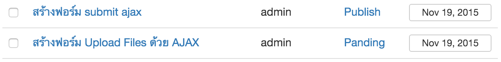
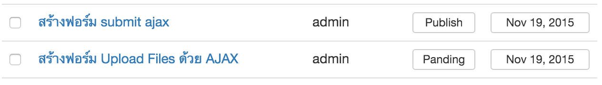
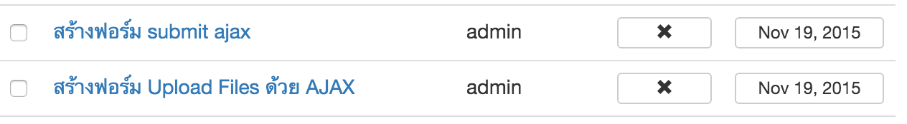
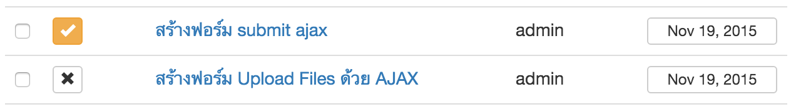
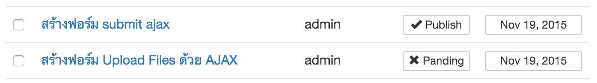
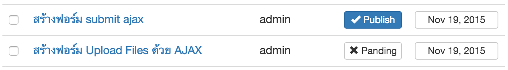

Yii2 Toggle Column
==================
yii2 toggle column for update in gridview


Installation
------------

The preferred way to install this extension is through [composer](http://getcomposer.org/download/).

Either run

```
php composer.phar require --prefer-dist dixonstarter/yii2-toggle-column "*"
```

or add

```
"dixonstarter/yii2-toggle-column": "*"
```

to the require section of your `composer.json` file.


Usage
-----

## GridView

```php
use yii\grid\GridView;
use yii\widgets\Pjax;

//.....

<?php Pjax::begin();?>
<?= GridView::widget([
    'dataProvider' => $dataProvider,
    'filterModel' => $searchModel,
    'tableOptions'=>['class'=>'table table-hover'],
    'columns' => [

      //.....
      [
        'attribute'=>'status',
        'class'=>'\dixonstarter\togglecolumn\ToggleColumn'
      ],
    ],
]); ?>
<?php Pjax::end();?>
```

## Controller

Add  action for update

```php
class PostController extends Controller
{

    public function actions(){
      return [

          //.....

          'toggle-update'=>[
              'class'=>'\dixonstarter\togglecolumn\actions\ToggleAction',
              'modelClass'=>Post::className()
          ]
      ];
    }

    //...

}

```

## Model

```php
class Post extends \yii\db\ActiveRecord implements \dixonstarter\togglecolumn\ToggleActionInterface
{

  // ....

  use \dixonstarter\togglecolumn\ToggleActionTrait;
  public function getToggleItems()
  {
    // custom array for toggle update
    return  [
      'on' => ['value'=>1, 'label'=>'Publish'],
      'off' => ['value'=>0, 'label'=>'Panding'],
    ];
  }
}
```

## Custom link style

### Clean



```php

    [
      'attribute'=>'status',
      'class'=>'\dixonstarter\togglecolumn\ToggleColumn',
      'options'=>['style'=>'width:50px;'],
      'linkTemplateOn'=>'<a class="toggle-column" data-pjax="0" href="{url}">{label}</a>',
      'linkTemplateOff'=>'<a class="toggle-column" data-pjax="0" href="{url}">{label}</a>'
    ],

```

### Button



```php

  [
    'attribute'=>'status',
    'class'=>'\dixonstarter\togglecolumn\ToggleColumn',
    'options'=>['style'=>'width:50px;'],
    'linkTemplateOn'=>'<a class="toggle-column btn btn-default btn-xs btn-block" data-pjax="0" href="{url}">{label}</a>',
    'linkTemplateOff'=>'<a class="toggle-column btn btn-default btn-xs btn-block" data-pjax="0" href="{url}">{label}</a>'
  ],

```

### Icon



```php

[
  'attribute'=>'status',
  'class'=>'\dixonstarter\togglecolumn\ToggleColumn',
  'options'=>['style'=>'width:50px;'],
  'linkTemplateOn'=>'<a class="toggle-column btn btn-default btn-xs btn-block" data-pjax="0" href="{url}"><i  class="glyphicon glyphicon-ok"></i> </a>',
  'linkTemplateOff'=>'<a class="toggle-column btn btn-default btn-xs btn-block" data-pjax="0" href="{url}"><i  class="glyphicon glyphicon-remove"></i> </a>'
],

```

### Icon Color



```php

[
  'attribute'=>'status',
  'class'=>'\dixonstarter\togglecolumn\ToggleColumn',
  'options'=>['style'=>'width:50px;'],
  'linkTemplateOn'=>'<a class="toggle-column btn btn-warning btn-xs " data-pjax="0" href="{url}"><i  class="glyphicon glyphicon-ok"></i> </a>',
  'linkTemplateOff'=>'<a class="toggle-column btn btn-default btn-xs " data-pjax="0" href="{url}"><i  class="glyphicon glyphicon-remove"></i> </a>'
],

```

### Icon & Label



```php

[
  'attribute'=>'status',
  'class'=>'\dixonstarter\togglecolumn\ToggleColumn',
  'options'=>['style'=>'width:50px;'],
  'linkTemplateOn'=>'<a class="toggle-column btn btn-default btn-xs btn-block" data-pjax="0" href="{url}"><i  class="glyphicon glyphicon-ok"></i> {label}</a>',
  'linkTemplateOff'=>'<a class="toggle-column btn btn-default btn-xs btn-block" data-pjax="0" href="{url}"><i  class="glyphicon glyphicon-remove"></i> {label}</a>'
],

```

### Icon & Button color



```php

[
  'attribute'=>'status',
  'class'=>'\dixonstarter\togglecolumn\ToggleColumn',
  'options'=>['style'=>'width:50px;'],
  'linkTemplateOn'=>'<a class="toggle-column btn btn-primary btn-xs btn-block" data-pjax="0" href="{url}"><i  class="glyphicon glyphicon-ok"></i> {label}</a>',
  'linkTemplateOff'=>'<a class="toggle-column btn btn-default btn-xs btn-block" data-pjax="0" href="{url}"><i  class="glyphicon glyphicon-remove"></i> {label}</a>'
],

```
